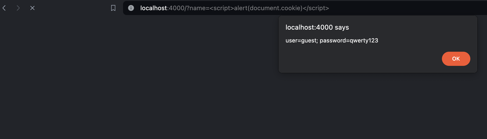
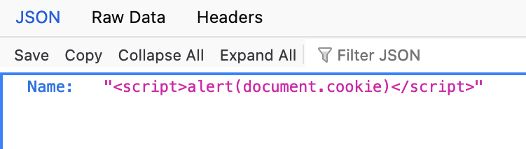

# Code is unsafe, you can run any script!

~~~go
func HelloHandler(w http.ResponseWriter, req *http.Request) {
	helloTemplate := `{{.}}`
	tmpl := template.New("hello")
	tmpl, _ = tmpl.Parse(helloTemplate)

	name := req.URL.Query().Get("name")

	_ = tmpl.Execute(w, name)
}
~~~

Example attack:
~~~js

~~~~

# Let's fix it

1. [Set explicitly Content-Type Header](main.go#L29)
2. [Support json response](main.go#L31)

