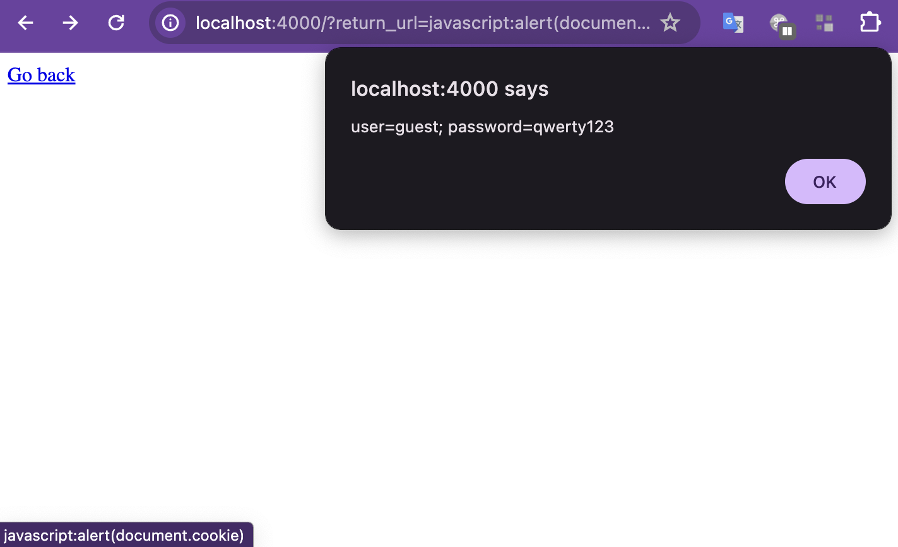
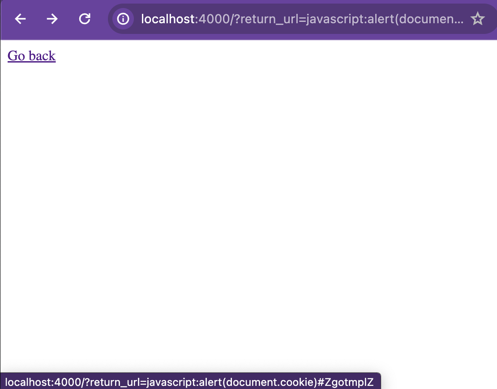

# Code is unsafe, you can run any script!

~~~go
func HelloHandler(w http.ResponseWriter, req *http.Request) {
	http.SetCookie(w, &http.Cookie{Name: "user", Value: "guest"})
	http.SetCookie(w, &http.Cookie{Name: "password", Value: "qwerty123"})

	helloTemplate := `
	<html>
	<head></head>
	<body>
		
<a href="%s">Go back</a>

	</body>
	</html>
	`
	returnUrl := req.URL.Query().Get("return_url")
	fmt.Fprintf(w, helloTemplate, returnUrl)
}
~~~

Example attack:
~~~js

~~~~

# Let's fix it

1. [Parse the input](main.go#L32)

