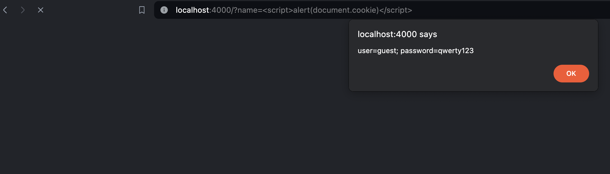
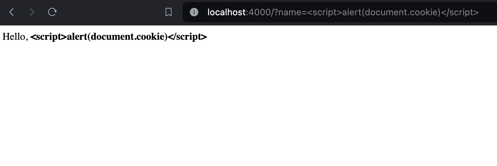

# [Cross Site Scripting (XSS)](https://owasp.org/www-community/attacks/xss/)

Cross-Site Scripting (XSS) attacks are a type of injection, in which malicious scripts are injected into otherwise benign and trusted websites. XSS attacks occur when an attacker uses a web application to send malicious code, generally in the form of a browser side script, to a different end user. Flaws that allow these attacks to succeed are quite widespread and occur anywhere a web application uses input from a user within the output it generates without validating or encoding it.

### Code is unsafe, you can run any script!

Example:
~~~js

~~~~

### Code is safe, now the input is encoded

